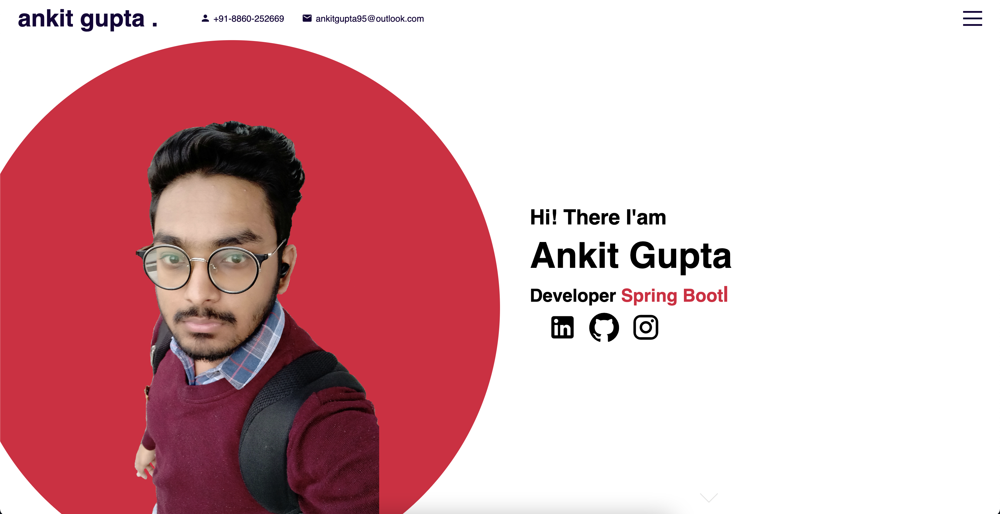

<p align="center">
  
</p>


<p align="center">A portfolio web-site  (Made with ❤️)</p>



## Features

- **Four sections** - Namely Home, Portfolio, Work and Contact
- **Technologies Used** - ReactJs, SCSS and SASS

## About

This is a personal portfolio from which other deveplopers can understand how things work in ReactJs.

## Demo Development

Clone and install.

```bash
git clone git@github.com:ankit-95/ankit-95.github.io.git
cd ankit-95.github.io
npm i
```

Run application.

```bash
npm start
```

## Acknowledgements

- A big thank you to [Safak
](https://github.com/safak) for guiding me.

## Author

- [Ankit Gupta](https://ankit-95.github.io)

